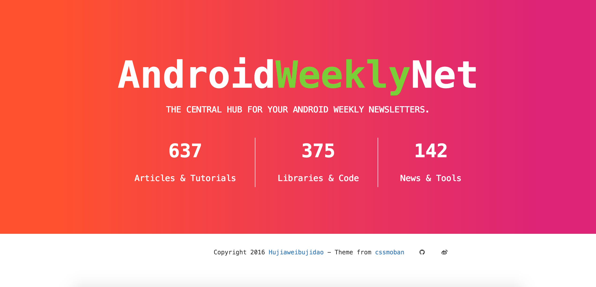

# Ganks for androidweekly.net

This project crawls and parses weekly newsletters created by [androidweekly.net](http://androidweekly.net/), which is a free newsletter that helps you to stay cutting-edge with your Android Development.

It not only parses the post items in one weekly issue, but also extracts the main content of each post item's web page for you.

**Notice that only weekly issues later than issue #103 are parsed since older weekly issues have diffrent DOM tree of web page and less helper for current Android development.**

If you want to parse older weekly issues, you can add these code in `src/main/java/data/AndroidWeeklyNetParser.java`

## Two main models

1. `WeeklyIssue` represents a weekly issue, eg, `Android Weekly Issue #80`

2. `WeeklyItem` represents a weekly post item, eg, `More Than a Lot of Google Maps Markers`

## How to use

(1) Simply use file `src/main/resources/androidweeklynet.json` as the result data, but it will not autoupdate, the latest weekly issue in this json file is issue-204 for now.

(2) Using Maven to compile and run this project

1.Run `mvn compile` to compile this project;  

2.Run `mvn exec:java -Dexec.mainClass="data.AndroidWeeklyNetCrawler"` to start crawling and caching the web pages;

3.Run `mvn exec:java -Dexec.mainClass="data.AndroidWeeklyNetParser"` to start parsing these web pages and generate the final result data.

(3) Build and run this project in your favorite IDE

1.Run `src/main/java/data/AndroidWeeklyNetCrawler.java`;  

2.Run `src/main/java/data/AndroidWeeklyNetParser.java`;  

3.Then you will see the result data in file `src/main/resources/androidweeklynet.json` in JSON format.

## The result data

The root of the json data is a JSON array containing all the weekly issues posted in [androidweekly.net](http://androidweekly.net/).

`items` in each weekly issue stands for the post items in this issue, and each item has its `url`、`summary`、`content`, etc.

```json
[
	{
		"file":"src/main/resources/androidweeklynetarchive/80.html",
		"id":"3b5ac6c6fef2672eabb3a86595461a67",
		"items":[],
		"num":80,
		"title":"Android Weekly Issue #80",
		"url":"http://androidweekly.net/issues/issue-80"
	},
	...
    {
        "file":"src/main/resources/androidweeklynetarchive/204.html",
        "id":"b8a2230be38ae5fc71ca6e55fbebe5f8",
        "items":[
            {
                "content":"The purpose of the article is to demonstrate a method on how to extend the capabilities of the Google Maps API on Android devices... ",
                "id":"f9b22c5d4bf03eb19117260b43114417",
                "shortUrl":"(leaks.wanari.com)",
                "source":"Android Weekly Issue #204",
                "summary":"The purpose of the article is to demonstrate a method on how to extend the capabilities of the Google Maps API on Android devices ...",
                "tags":[],
                "title":"More Than a Lot of Google Maps Markers",
                "type":"Articles & Tutorials",
                "url":"http://leaks.wanari.com/2016/05/05/rendering-markers-for-android/"
            },
            ...
        ],
        "num":204,
        "title":"Android Weekly Issue #204",
        "url":"http://androidweekly.net/issues/issue-204"
    },
...
]
```

## The website included

The simple website included in this project is just a page showing the statistics information about the result data.    
You can find out more interesting usages with the result data, such as a powerful search engine based on these data, which in still under development in my other project.  

Run `src/main/java/web/WebServer.java` and open `http://0.0.0.0:4567/` in your browser, you will see this web page.



## The libraries used

Many famous open source libraries are used in this project, including `crawler4j`,  `fastjson`, `jsoup`, `velocity`, `spark` and so on.

Two tools are much more important, one is [dragnet](https://github.com/seomoz/dragnet), which is a Python library used to extract the content of a web page. The other is [sessiondb](https://github.com/ctriposs/sessdb), which is a Big, Fast, Persistent Key/Value Store based on a variant of LSM, you can find more about it [here](http://ctriposs.github.io/sessdb/).

## License

```
The MIT License (MIT)

Copyright (c) 2016 Hujiawei

Permission is hereby granted, free of charge, to any person obtaining a copy
of this software and associated documentation files (the "Software"), to deal
in the Software without restriction, including without limitation the rights
to use, copy, modify, merge, publish, distribute, sublicense, and/or sell
copies of the Software, and to permit persons to whom the Software is
furnished to do so, subject to the following conditions:

The above copyright notice and this permission notice shall be included in all
copies or substantial portions of the Software.

THE SOFTWARE IS PROVIDED "AS IS", WITHOUT WARRANTY OF ANY KIND, EXPRESS OR
IMPLIED, INCLUDING BUT NOT LIMITED TO THE WARRANTIES OF MERCHANTABILITY,
FITNESS FOR A PARTICULAR PURPOSE AND NONINFRINGEMENT. IN NO EVENT SHALL THE
AUTHORS OR COPYRIGHT HOLDERS BE LIABLE FOR ANY CLAIM, DAMAGES OR OTHER
LIABILITY, WHETHER IN AN ACTION OF CONTRACT, TORT OR OTHERWISE, ARISING FROM,
OUT OF OR IN CONNECTION WITH THE SOFTWARE OR THE USE OR OTHER DEALINGS IN THE
SOFTWARE.
```
